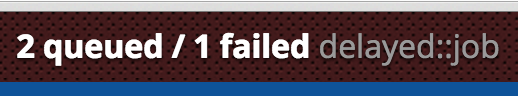

# Peek::DelayedJob

Take a peek into the current state of your [Delayed::Job](https://github.com/collectiveidea/delayed_job) queue – see the [peek](https://github.com/peek/peek) project for general information.



Only supports the DelayedJob ActiveRecord backend at the moment.

## Installation

Add this line to your application's Gemfile:

```ruby
gem 'peek-delayed_job'
```

And then execute:

    $ bundle

Or install it yourself as:

    $ gem install peek-delayed_job

## Usage

Add the following to your `config/initializers/peek.rb`:

```ruby
Peek.into Peek::Views::DelayedJob
```
